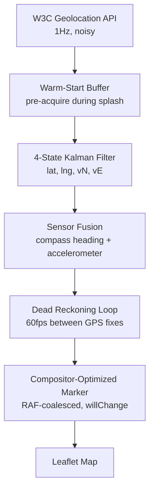

<div align="center">
  

# Minnesota Then: Museum Without Walls

**A privacy-first, client-side-only location engine that brings historical exhibits to the exact spots where they happened.**

[](LICENSE-MPL)
[](https://creativecommons.org/licenses/by-nc/4.0/)
[]()
[]()

</div>

---

## Overview

No app store. No signups. No backend tracking your movements. Just a browser, doing things browsers aren't supposed to be able to do.

Built on a custom real-time sensor fusion pipeline, it maintains sub-meter positioning accuracy using only the W3C Geolocation API, device compass, and accelerometer — no native code, no Mapbox/Google SDKs, no data collection.

> [!IMPORTANT]
> **To our knowledge, this is the most sophisticated open-source, browser-based GPS positioning system available.** No comparable project combines real-time Kalman filtering, dead reckoning, and sensor fusion in vanilla JavaScript.

## 🎯 What It Actually Does

1. **Walk up to a historical site** — the engine detects proximity within ~6 meters
2. **Unlock rich multimedia** — archival photos, audio narration, curated stories
3. **Move on** — the engine tracks you to the next site with smooth, drift-free positioning

All processing happens on-device. Your location history never leaves your phone.

---

## 🧭 The Positioning Engine

Most "GPS apps" are just `navigator.geolocation.watchPosition` with a marker. This is different.

### Core Pipeline



### What That Solves

| Problem | Standard Web App | Minnesota Then |
|--------|------------------|----------------|
| **GPS updates at 1Hz** | Marker freezes between fixes | Dead reckoning predicts position at 60fps using velocity vectors |
| **Standing still = drifting** | GPS noise makes you wander | Accelerometer-gated freeze with hysteresis |
| **Cold-start lag** | 3–10 seconds to first fix | Warm-start acquisition during splash screen |
| **iOS geolocation quirks** | Broken audio, ghost clicks, permission timing | Handled explicitly |
| **Background/foreground** | Full re-initialization | Stateful resume with velocity seeding |
| **Stationary→movement lag** | Filter resists tracking for ~1s | Velocity variance pre-boost on breakout detection |
| **Zoom oscillation** | Jumps between zoom levels | Priority-based zoom controller with lock durations |

<details>
<summary><strong>⚙️ Deep Dive: Technical Stack & Architecture</strong></summary>

**Dependencies:** Leaflet.js, Bootstrap, Font Awesome  
**Custom Code:** ~2,800 lines of positioning pipeline

**Core Modules:**
- `PositionKalmanFilter` — 4-state EKF with adaptive process noise, reference frame shifting, velocity seeding, and gap recovery
- `SensorFusionManager` — device orientation (compass) + accelerometer integration with permission gating
- `DeadReckoning` — RAF-based predictive loop with speed-scaled horizon and drift thresholds
- `ModeManager` — speed-based mode transitions (roaming ↔ centered) with pending-state elimination of split-brain windows
- `ZoomController` — zero-GC priority queue for smooth zoom authority
- `LocationCooldownManager` — per-location visit gating with proximity-aware auto-reopen

**Browser APIs Used:**
- `navigator.geolocation` (high-accuracy watchPosition)
- `DeviceOrientationEvent` / `DeviceOrientationAbsoluteEvent` (compass)
- `Accelerometer` (Generic Sensor API, permission-gated)
- `WakeLock` (screen-on during audio playback)
- `MediaSession` (lock-screen audio controls)
- `ServiceWorker` (update lifecycle management, not positioning)

</details>

---

## 🏛️ The Museum Experience

The positioning engine powers a seamless historical exploration flow:

1. **Discovery** — Navigate to marked historical sites across Minnesota
2. **Proximity Unlock** — Content appears automatically within ~20 feet
3. **Audio Docent** — Narrated history with background-aware playback recovery
4. **Deep Context** — Archival photos, source citations, difficulty ratings
5. **Continue** — Cooldown system prevents re-triggering; proximity engine finds the next site

### Content Features
- Custom marker clustering with tour-type color coding
- Progressive image preloading based on proximity
- Tile prefetching at target zoom levels
- Responsive audio player with scrubbing, MediaSession integration, and interruption recovery
- Accessibility-first: screen reader announcements, keyboard navigation, focus management

---

## 📱 PWA Architecture

- Installable to home screen (iOS Safari, Android Chrome, desktop)
- Standalone display mode with theme-color integration
- Post-install guidance
- Graceful degradation when installed vs. browser-tab

---

## 🚀 Getting Started

```bash
git clone https://github.com/yourusername/minnesota-then.git
cd minnesota-then
# Serve with any static file server
python -m http.server 8000
# Or: npx serve ., or open index.html directly (some features require HTTPS)
```

**Requirements:**
- Modern browser with Geolocation API support
- HTTPS (except localhost) for sensor APIs
- Location permissions

---

## 📂 Project Structure

```
minnesota-then/
├── index.html              # Main entry — contains full positioning pipeline
├── css/
│   ├── mainmap.css         # Map styling
│   └── mnthen_main_map2.css
├── js/
│   └── locations_main.js   # Location data (content, coordinates, media URLs)
├── images/
├── manifest.json           # PWA manifest
└── sw.js                   # Service worker (update management)
```

> [!NOTE]
> The positioning engine lives entirely in `index.html` as vanilla JavaScript IIFEs. No build step. No bundler. No framework overhead.

## 🔮 Why No Framework?

The positioning pipeline runs at 60fps with sub-16ms frame budgets. Adding a virtual DOM reconciliation layer would introduce unpredictable garbage collection pauses and make RAF scheduling unreliable. Every allocation is intentional; the Kalman filter reuses matrix buffers, the zoom controller uses a Map instead of arrays, and all timers are tracked for leak-free cleanup.

<details>
<summary><strong>📊 Performance Characteristics</strong></summary>

- **Marker updates:** RAF-coalesced, compositor-layer promoted
- **GPS power scaling:** `maximumAge`/`timeout` adapt to movement state (stationary: 5s/20s, driving: 1s/10s)
- **Memory:** Tracked timeout registry, cleanup on pagehide, WeakMap-based deduplication
- **Background:** 30s fix throttling, full state preservation

</details>

---

## 📄 License

This project uses a dual-license structure. Please ensure you understand the boundaries between code and content.

> [!CAUTION]
> ### Code: Mozilla Public License 2.0
> The positioning engine, UI components, and all JavaScript/CSS in this repository are licensed under MPL-2.0.
> - You can use, modify, and distribute the code.
> - Modifications to existing files must be shared under MPL-2.0.
> - New files you add can be under any license.
> - Patent rights are granted to users.
> 
> *See [LICENSE-MPL](LICENSE-MPL) for the full text.*

> [!WARNING]
> ### Content: CC BY-NC 4.0
> Historical articles, audio narration, images, location descriptions, and curated stories are licensed under [Creative Commons Attribution-NonCommercial 4.0 International](https://creativecommons.org/licenses/by-nc/4.0/).
> - **Attribution** — Credit Minnesota Then and the original creator.
> - **NonCommercial** — No commercial use without explicit permission.
> - **ShareAlike** — Adaptations must use the same license.
> 
> *This applies to all content in `js/locations_main.js`, `images/`, and referenced audio files.*
> 
> **For commercial licensing inquiries:** [mattreicher@protonmail.com](mailto:mattreicher@protonmail.com)

---

## 🙏 Acknowledgements

- **Minnesota Historical Society** — archival data and photographs
- **Metropolitan State University** — research methodology
- **OpenStreetMap** — map tiles (© OSM contributors)
- **Leaflet.js** — mapping library
- **All contributors** — researchers, testers, developers

## 📞 Contact

[mattreicher@protonmail.com](mailto:mattreicher@protonmail.com)

